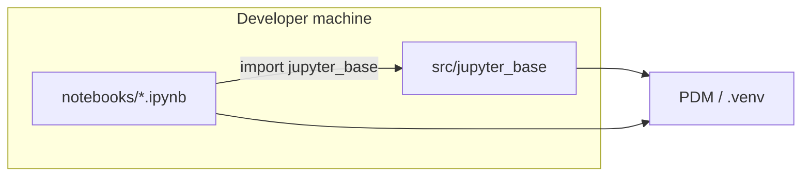

# Jupyter-Base

A production-minded template for **JupyterLab** plus a **reusable Python library** in a `src/` layout. Dependencies and the virtual environment are managed with **PDM**, day-to-day tasks use a **Makefile**, optional **Docker** runs match local behavior, and **GitHub Actions** keep linting, tests, and image builds honest. **AWS ECS** starter notes live under `deploy/`.

## Capabilities

- Import `jupyter_base` from notebooks and services without `sys.path` hacks (editable install via PDM).
- Typed configuration via environment variables and an optional `.env` file.
- **`OpenAIClient`** in `jupyter_base` wraps the OpenAI SDK so notebooks can call the API without putting the key in cells; credentials are resolved from `.env`, a key file, or the environment (see [OpenAI client](#openai-client-backend)).
- Example domain code: models, a small workflow, and text utilities with real unit tests.
- JupyterLab locally (`make run-jupyter`) or in Docker (`make run-jupyter-docker`).
- Quality gates: Ruff (lint + format), mypy, pytest (with coverage in CI).

## Architecture overview



- **`src/jupyter_base`**: installable package (config, core types, services, utils).
- **`notebooks/`**: interactive work; kept separate from library code.
- **`tests/`**: pytest suite; `tests/unit/` holds fast unit tests.
- **`docker/`**: Jupyter entrypoint script used by the root `Dockerfile`.
- **`deploy/`**: ECS-oriented documentation and an example task definition JSON.

## Repository structure

| Path | Purpose |
|------|---------|
| `src/jupyter_base/` | Backend package (`config`, `core`, `services`, `utils`) |
| `notebooks/` | Jupyter notebooks (`example_notebook.ipynb`, `openai_client_example.ipynb`) |
| `tests/` | Pytest tests and shared fixtures |
| `data/` | Default data directory (empty; referenced by settings) |
| `docker/` | `jupyter-entrypoint.sh` |
| `deploy/` | ECS notes and `ecs-task-definition.example.json` |
| `.github/workflows/` | CI (lint, format check, mypy, pytest, Docker build) |
| `pyproject.toml` | Project metadata, PDM dependency groups, tool config |
| `pdm.lock` | Locked dependencies (commit this file) |
| `Makefile` | Install, quality, Jupyter, and Docker shortcuts |
| `Dockerfile` / `docker-compose.yml` | JupyterLab in a container |
| `.env.example` | Documented environment variables |

## Prerequisites

- **Python** 3.11+ (3.12+ recommended to match CI and the Docker image).
- **[PDM](https://pdm-project.org/)** 2.x (`pip install pdm` or your package manager).
- **Make** (macOS/Linux; Windows users can run the underlying `pdm` commands from the Makefile).
- **Docker Desktop** (or compatible engine) if you use the Docker workflows.

## Local setup

```bash
cp .env.example .env   # optional; edit values
make install             # pdm sync with dev, test, notebook groups
```

Verify:

```bash
make test
```

## PDM usage

- **Install locked deps (recommended):** `pdm sync -G dev -G test -G notebook` (same as `make install`).
- **Add a runtime dependency:** `pdm add <package>`.
- **Add a dev dependency:** `pdm add -dG dev <package>`.
- **Refresh the lockfile:** `pdm lock` (or `make lock`).
- **Run a tool in the project env:** `pdm run pytest`, `pdm run ruff check src`, etc.

The project package is installed **editable**, so changes under `src/jupyter_base/` are immediately visible to notebooks using that environment.

## Make targets

Run `make help` for the full list. Common targets:

| Target | Description |
|--------|-------------|
| `install` | Sync dev, test, and notebook groups from `pdm.lock`, then register the **`Python (jupyter-base)`** kernel |
| `install-jupyter-kernel` | Register / refresh the `jupyter-base` ipykernel spec only (after `pdm sync`) |
| `lock` / `update` | Regenerate or bump dependencies |
| `test` / `test-unit` | Full suite or `tests/unit` only |
| `lint` / `format` / `format-check` | Ruff |
| `typecheck` | mypy on `src/jupyter_base` |
| `quality` | Lint, format check, typecheck, and tests |
| `run-jupyter` | JupyterLab on `http://127.0.0.1:8888` (see below) |
| `stop-jupyter` | Stop local JupyterLab bound to `notebooks/` |
| `run-jupyter-docker` / `stop-jupyter-docker` | Docker Compose up/down |
| `build-docker` | Build the Jupyter image |
| `clean` | Remove caches and build artifacts |

Default Jupyter port: **8888** (override with `make run-jupyter JUPYTER_PORT=8890`).

## Running Jupyter locally

```bash
make run-jupyter
```

Open the URL printed in the terminal (includes an access token). The server uses the **same PDM environment** as `make test`, so `import jupyter_base` works as long as you started Jupyter via `pdm run` / `make run-jupyter`.

Stop:

```bash
make stop-jupyter
```

## Running Jupyter in Docker

```bash
make run-jupyter-docker
```

- The compose file **bind-mounts the repository** into `/app`; the entrypoint runs `pdm sync -G notebook` so the mounted `pyproject.toml` / `pdm.lock` stay authoritative.
- Notebooks persist under `./notebooks` on the host.
- By default **no token** is set (suitable for localhost only). For shared networks, set `JUPYTER_LAB_TOKEN` in your environment or `docker-compose.yml`.

```bash
make stop-jupyter-docker
```

## How notebook imports work

1. **`src/` layout** — the import name is always `jupyter_base`, not a repo-relative path.
2. **Editable install** — `pdm sync` / `make install` installs the project into the active env.
3. **Same interpreter** — run Jupyter with `pdm run jupyter lab` (or Docker entrypoint using PDM) so kernels see that env.
4. **Correct kernel** — `make install` registers a kernelspec **`Python (jupyter-base)`** that points at this project’s `.venv`. In JupyterLab, pick that kernel (top-right kernel name). If the notebook uses another kernel (for example a system Python), `import jupyter_base` will fail.

This avoids scattered `sys.path.append(...)` cells and the “wrong kernel” problem.

## OpenAI client (backend)

Use **`OpenAIClient`** from the installable package so the API key is resolved inside `jupyter_base`, not pasted into notebook cells.

### Configure credentials

The key is resolved in this order (first match wins):

1. **Key file** — set `JUPYTER_BASE_OPENAI_KEY_FILE` in `.env` or the shell to a path whose **first line** is the key. Paths relative to the repo root are resolved under that root. A typical layout is `.secrets/openai_api_key` (the repo’s `.gitignore` ignores `.secrets/`).
2. **`OPENAI_API_KEY`** in the process environment (CI, shell export, Docker secrets).
3. **`OPENAI_API_KEY`** in `.env` — unlike a raw `load_dotenv()` call, **`load_settings()` does not copy `.env` into `os.environ`**, so a key stored only in `.env` is not visible to `os.environ.get("OPENAI_API_KEY")` after `load_settings()`. `OpenAIClient` still reads it by parsing `.env` on demand.

See **`.env.example`** for commented examples.

### Use in a notebook

A runnable walkthrough lives at [`notebooks/openai_client_example.ipynb`](notebooks/openai_client_example.ipynb). Minimal usage:

```python
from jupyter_base import OpenAIClient

client = OpenAIClient()

# Simple single-turn reply (string in, string out)
text = client.complete_text(
    user="Summarize JupyterLab in one sentence.",
    model="gpt-4o-mini",
    system="You are a concise assistant.",
)
print(text)
```

For full control over messages and parameters, use **`chat_completion`**, which mirrors `chat.completions.create` and returns the SDK response object:

```python
response = client.chat_completion(
    model="gpt-4o-mini",
    messages=[
        {"role": "system", "content": "You reply briefly."},
        {"role": "user", "content": "What is PDM?"},
    ],
)
print(response.choices[0].message.content)
```

The **`responses`** and **`chat`** attributes match the official [`openai`](https://github.com/openai/openai-python) client, so you can use the [Responses API](https://platform.openai.com/docs/api-reference/responses) without constructing `OpenAI` yourself:

```python
response = client.responses.create(
    model="gpt-4.1-mini",
    instructions="You are a helpful assistant.",
    input="Explain how neural networks work in simple terms.",
)
print(response.output[0].content[0].text)
```

Optional constructor arguments (defaults suit a notebook started from the repo root):

- **`repo_root`** — repository root if the working directory is not the project root.
- **`env_file`** — explicit path to a dotenv file instead of `<repo_root>/.env`.
- **`api_key`** — override (mostly for tests); prefer configuration files or the environment in normal use.

### Keeping `OPENAI_API_KEY` out of the kernel environment

Notebook code is still Python: it can read files or any variables the process already has. To avoid passing the secret through **`os.environ`** (for example so `os.environ.get("OPENAI_API_KEY")` is empty in the kernel), store the key in a file, point **`JUPYTER_BASE_OPENAI_KEY_FILE`** at it, omit `OPENAI_API_KEY` from the environment, and start Jupyter with:

```bash
make run-jupyter JUPYTER_STRIP_OPENAI_ENV=1
```

That starts Lab with `OPENAI_API_KEY` unset for the server and its child kernels; `OpenAIClient` continues to load the key from the file via your `.env` settings.

## Tests and quality checks

```bash
make quality
```

Or step by step: `make lint`, `make format-check`, `make typecheck`, `make test`.

## Contributing

1. Create a branch and make changes under `src/jupyter_base/` or tests.
2. Run `make quality` before pushing.
3. Optional: `pre-commit install` to run Ruff on commit (see `.pre-commit-config.yaml`).

## GitHub Actions

Workflow: `.github/workflows/ci.yml`

- On pushes and PRs to `main`: sync with PDM, **Ruff** (check + format check), **mypy**, **pytest** with coverage, and a **Docker** build (no push).

## AWS ECS deployment approach

See **`deploy/README.md`** for image assumptions, environment variables, secrets, and a high-level rollout checklist. **`deploy/ecs-task-definition.example.json`** is a placeholder Fargate task definition—replace account IDs, subnets, roles, and image URIs before use.

## Troubleshooting

| Issue | What to try |
|-------|-------------|
| `ModuleNotFoundError: jupyter_base` | Run `make install` (registers **`Python (jupyter-base)`**). In the notebook, switch the kernel to **Python (jupyter-base)**. Start Jupyter with `make run-jupyter` or Docker (not a system-wide Jupyter). Run `make install-jupyter-kernel` if you already synced but skipped kernel registration. |
| Notebook sees old code | Restart the kernel; confirm the kernel’s Python is `.venv/bin/python` (PDM’s venv). |
| Docker is slow on first start | First `pdm sync` inside the container downloads dependencies; subsequent starts are faster if the mount preserves `.venv`. |
| Port 8888 in use | `make run-jupyter JUPYTER_PORT=8890` or set `JUPYTER_PORT` for Compose. |
| `OpenAIClient` raises “API key not configured” | Set `OPENAI_API_KEY`, add it to `.env`, or set `JUPYTER_BASE_OPENAI_KEY_FILE` to a file containing the key (see [OpenAI client](#openai-client-backend)). |
| mypy or Ruff failures in CI | Run `make quality` locally on the same Python version as CI (3.12). |

## Design choices (short)

- **Hatchling** as the PEP 517 build backend for broad compatibility; PDM still manages locks and environments.
- **Ruff** for lint and format to keep tooling simple.
- **docker-compose** mounts the repo for developer parity; production ECS images should rely on the baked `Dockerfile` layers without bind-mounting source.

## Build prompt

To recreate or extend this repository with an LLM, use [`prompts/jupyter-base-prompt.txt`](prompts/jupyter-base-prompt.txt) (in Cursor you can reference `@prompts/jupyter-base-prompt.txt`).
